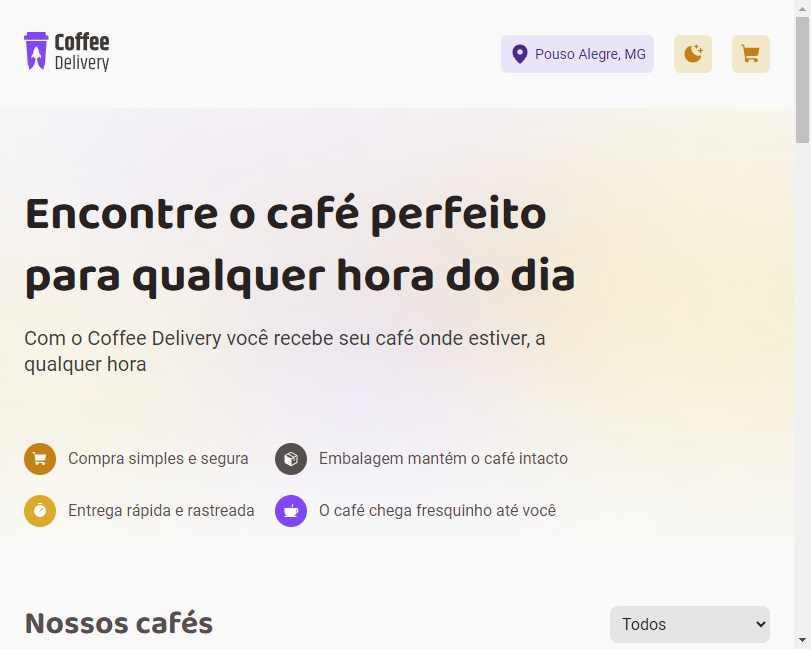

# Coffee Delivery - Ignite.

Projeto construído para aplicação dos estudos Ignite. É uma aplicação de fluxo de compra on-line, que contém um catálogo de produtos, podendo adicionar a quantidade de café de sua preferência e preencher o formulário de entrega.

[🔗Clique aqui para acessar](https://luizctb.github.io/coffe)

## 🛠️ Tecnologias 

- [Vite](https://vitejs.dev/)
- [React](https://pt-br.reactjs.org/)
- [TypeScript](https://www.typescriptlang.org/)
- [React Hook Form](https://react-hook-form.com/)
- [Styled Components](https://styled-components.com/)
- [ESLint](https://eslint.org/)

E-mail:💻 luizcarlostb@hotmail.com
[Github:](https://github.com/luizctb/coffe)